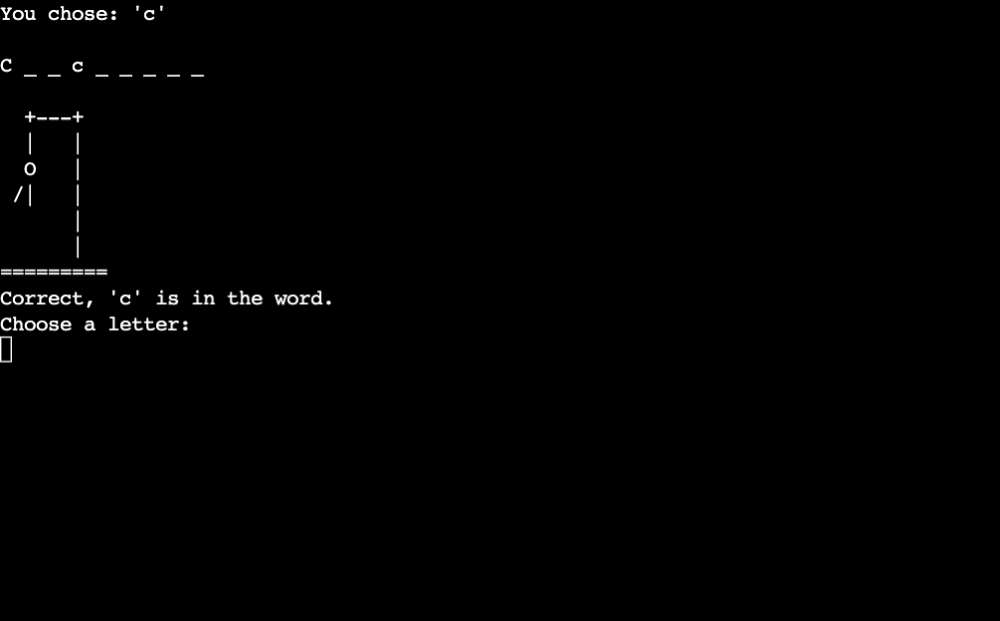
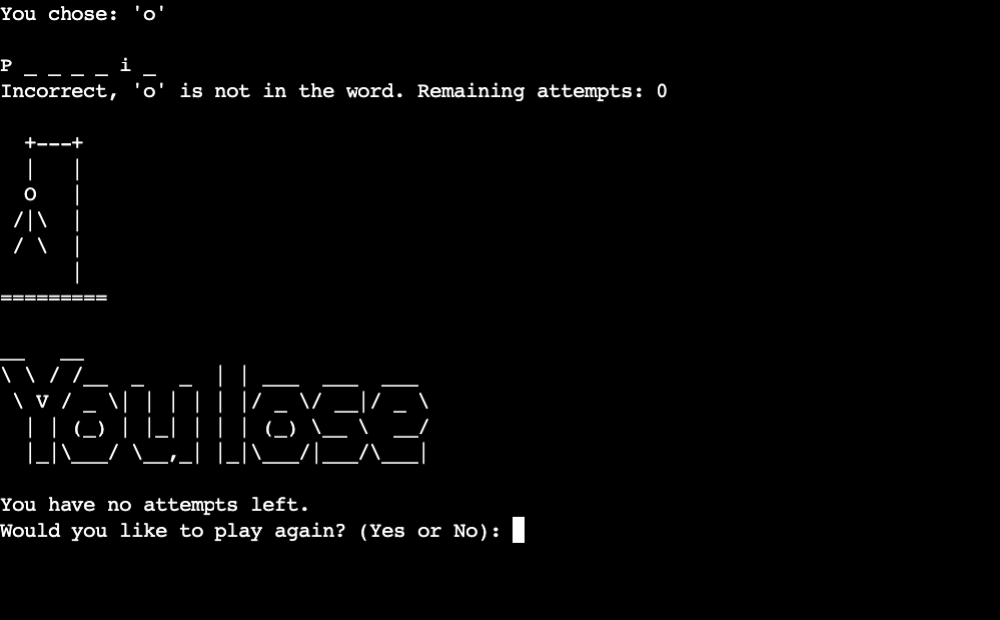
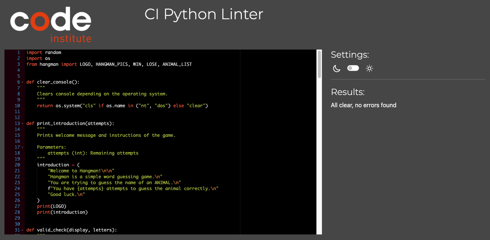

# Hangman

## Description

Hangman is a popular word guessing game. In this version, your goal is to guess the name of an animal. You only have a certain amount of attempts to guess the word correctly by suggesting letters one at a time. Each incorrect guess reduces your remaining attempts.

Play my version of Hangman [here](https://ydr-hangman-80c9bb83a43f.herokuapp.com/)!

## How to Play

1. **Start Game**: The game begins automatically as soon as the program runs.

2. **Guess Letters**: Input a letter and try to guess the animal.

3. **End of Game**: Guess all the letters correctly before running out of attempts.<br>
Win or lose, after the game ends, you will be given the choice to play again.

## Features

- Random word selection of animal names
- Clear feedback
- ASCII art
- Remaining attempts and guessed letters tracking
- Option to play again after the game ends

### Start of the Game

- **Title**: On the top of the page, players are greeted with an ASCII art, spelling the title of the game.
- **Welcome Message**: Short introduction to the game and it's rules.
- **Searched Word**: The animal to guess is displayed with underscores for each letter.
- **User Prompt**: Asking the player to choose a letter.

### During the Game



- **Validation Response**: Various checks, if player input is valid or not.
- **Progression**: Visual feedback of hangman progression and remaining attempts.

### End of the Game


- **Win or Lose**: ASCII art and message based on win or lose.
- **Play Again Prompt**: Option to restart the game or not.

## Testing

### Print Statements
I extensively used print() statements throughout the development of this game to debug and gain insights of my code behaviour:
 - Input Handling
 - Function Execution
 - Game Progression

Example:
```bash
  print(animal)
```

### Unfixed Bugs
A bug where the deployment terminal is not totally being cleared. It is only visible when you scroll up the terminal, otherwise it is not.<br>
The bug usually appears after inputting more than a single character or after multiple invalid inputs.

### Validator Testing
[Python Linter](https://pep8ci.herokuapp.com/#) from Code Institute:



## Deployment

This project was deployed using [Heroku](https://id.heroku.com/login):
- Create a new Heroku app
- Add two buildpacks from the "Settings" tab in that order:
    - Python
    - NodeJS
- Add Config Vars from the "Settings" tab:
    - Key: PORT
    - Value: 8000
- Connect your GitHub repository and deploy as normal

## Credits

### Content

- The ASCII art for the hangman progressions are originally from [Chris Horton](https://gist.github.com/chrishorton/8510732aa9a80a03c829b09f12e20d9c), I have merely reversed the order
- The ASCII art for the logo is from [ascii.co.uk](https://ascii.co.uk/art/hangman)
- The ASCII art for 'you win' and 'you lose' I have created using [asciiart.eu](https://www.asciiart.eu/text-to-ascii-art)
- The content of the list of animals, I created with [perplexity](https://www.perplexity.ai/)
- The clear console function is from [delftstack](https://www.delftstack.com/howto/python/python-clear-console/)


### References

- I used my own project [Stratagem Hero](https://github.com/yanidruffy/stratagem-hero) as well as Code Institute's readme provided to help me with my readme file
- [Dr. Angela Yu](https://www.udemy.com/course/100-days-of-code/?couponCode=OF52424#instructor-1) and her 100 Days of Code helped me with my understanding of Python and game logic
- [Hangmanwords.com](https://www.hangmanwords.com/how-to) inspired me on how to shortly introduce this game
- [W3School](https://www.w3schools.com/python/) with their tutorials and explanations
- [Programiz](https://www.programiz.com/python-programming/docstrings) for their explanation of docstrings in Python
- [Real Python's guide on if __name__=="__main__"](https://realpython.com/if-name-main-python/) 

### Acknowledgements

- Special thanks to my mentor [Spence](https://5pence.net/) for his guidance and support. His insights on using join and strip for efficient coding practices have changed the development for this game to the better. Additionally, the recommended resource of Real Python was very welcome as well as the suggestion of adding a restart function and helping me put on the final touches
- Thank you to Marceillo for testing my program.
- I want to thank my other colleagues, as well as my cohort Kristyna for their continued support